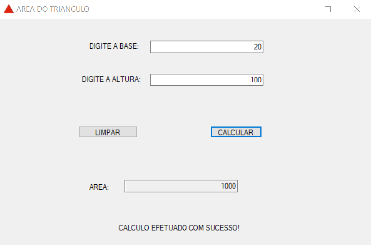

# AREA DO TRIANGULO
👨‍🏫CALCULO DA AREA DO TRIÂNGULO COM WINFORMS.

  

## DESCRIÇÃO:
Este projeto WinForms é uma aplicação simples para calcular a área de um triângulo. O usuário insere a base e a altura do triângulo, e o programa calcula a área e exibe o resultado. A aplicação valida as entradas para garantir que os campos não estejam vazios e que os valores inseridos sejam numéricos. Também oferece a funcionalidade de limpar os campos de entrada e resultado. Mensagens de sucesso ou erro são exibidas para orientar o usuário durante o uso da aplicação.

## FUNCIONALIDADES:
1. **Cálculo da Área de um Triângulo**:
   - **Entrada de Dados**: O usuário insere a base e a altura do triângulo em caixas de texto (`TbBase` e `TbAltura`).
   - **Cálculo**: Ao clicar no botão `BtCalcular`, o programa calcula a área do triângulo usando a fórmula: 
     \[
     \text{Área} = \frac{\text{Base} \times \text{Altura}}{2}
     \]
   - **Validação**: O programa verifica se os campos não estão vazios e se os valores inseridos são numéricos válidos.
   - **Resultado**: O resultado do cálculo é exibido em uma caixa de texto (`TbResultado`).
   - **Mensagens**: Mensagens de sucesso ou erro são exibidas em um label (`LbMensagem`).

2. **Limpeza dos Campos**:
   - **Limpar Entradas e Resultados**: Ao clicar no botão `BtLimpar`, todos os campos de entrada, o resultado e a mensagem são limpos.

## EXECUTANDO O PROJETO:
### ABRINDO NO VISUAL STUDIO:
- Abra o projeto `./CODIGO` no Visual Studio:
  1. Abra o Visual Studio.
  2. Clique em `File` > `Open` > `Project/Solution`.
  3. Navegue até o diretório `./CODIGO`.
  4. Selecione o arquivo da solução (`.sln`) do projeto e clique em `Open`.
  5. No Solution Explorer, abra o arquivo `Program.cs` para ver o código-fonte.

#### COMPILANDO E EXECUTANDO O PROJETO:
1. Pressione `Ctrl + Shift + B` para compilar o projeto.
2. Após a compilação, pressione `Ctrl + F5` para executar o projeto sem depuração.

### ABRINDO O EXECUTÁVEL:
- Abra o executável em `CODIGO\WindowsFormsApp1\bin\Debug\WindowsFormsApp1.exe`:
  1. Abra o Explorador de Arquivos.
  2. Navegue até o diretório `CODIGO\WindowsFormsApp1\bin\Debug`.
  3. Dê um duplo clique no arquivo `WindowsFormsApp1.exe` para executar o aplicativo.

### INTERAGINDO COM APP:
1. **Iniciar o Programa**:
   - Abra o aplicativo e a janela principal (`FormInicio`) será exibida.

2. **Inserir Dados**:
   - Insira a base do triângulo na caixa de texto `BASE`.
   - Insira a altura do triângulo na caixa de texto `ALTURA`.

3. **Calcular a Área**:
   - Clique no botão `CALCULAR`.
   - O programa verificará se os campos estão preenchidos e se os valores são numéricos válidos.
     - Se os campos estiverem vazios, a mensagem "ERRO: POR FAVOR, PREENCHA TODOS OS CAMPOS!" será exibida.
     - Se os valores não forem numéricos, a mensagem "ERRO: POR FAVOR, INSIRA VALORES NUMÉRICOS VÁLIDOS!" será exibida.
     - Se tudo estiver correto, a área calculada será exibida em `TbResultado` e a mensagem "CALCULO EFETUADO COM SUCESSO!" será mostrada.

4. **Limpar os Campos**:
   - Clique no botão `LIMPAR` para limpar todos os campos e mensagens.

## NÃO SABE?
- Entendemos que para manipular arquivos nas linguagens relacionadas, é necessário possuir conhecimento nessas áreas. Para auxiliar nesse aprendizado, oferecemos cursos gratuitos disponíveis:
* [CURSO DE WINFORMS](https://github.com/VILHALVA/CURSO-DE-WINFORMS)
* [CURSO DE C#](https://github.com/VILHALVA/CURSO-DE-C-SHARP)
* [CONFIRA MAIS CURSOS](https://github.com/VILHALVA?tab=repositories&q=+topic:CURSO)

## CREDITOS:
- [PROJETO FEITO PELO VILHALVA](https://github.com/VILHALVA)
- [VEJA O VIDEO DESSE PROJETO](https://youtu.be/b2TsMmVP7Fw?si=LMTBpfZZ3citU4Zz)

